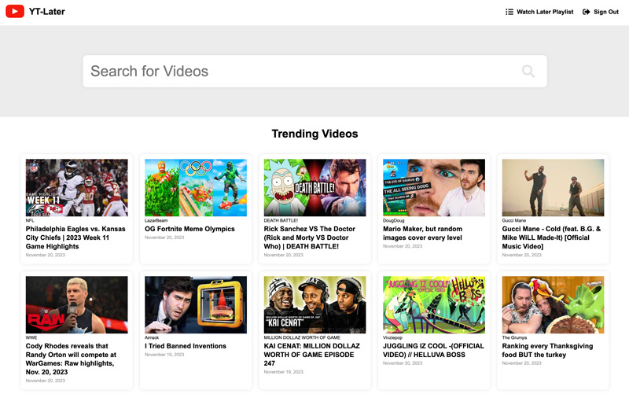

# YT-Later

A purely front-end javascript web application that allows you to search YouTube for videos and add them to a "watch later" playlist that's stored in your browser's local storage.

View a [live demo here](https://nick.do/yt-later).

## How to Install and Use

Simply point your web server to the static files in the `dist` directory.

You will need to obtain your own API key from Google in the [API Dashboard](https://console.cloud.google.com/apis/credentials) and enable the YouTube Data API v3 service for your key.

It's highly recommended that you hve an SSL certificate installed on the host, since you will be making requests with your API key in the URL.

## How to Build the Project for Development

This project uses webpack to build its source files. Make sure you have node, npm, and webpack installed.

Change the "mode" in `webpack.config.js` to  `"development"`.

Run the command `npm install`.

To start the development server, run this command: `npm start`.

To build the files in the `src` directory and output the files into the dist directory, run this command: `npm run build`.